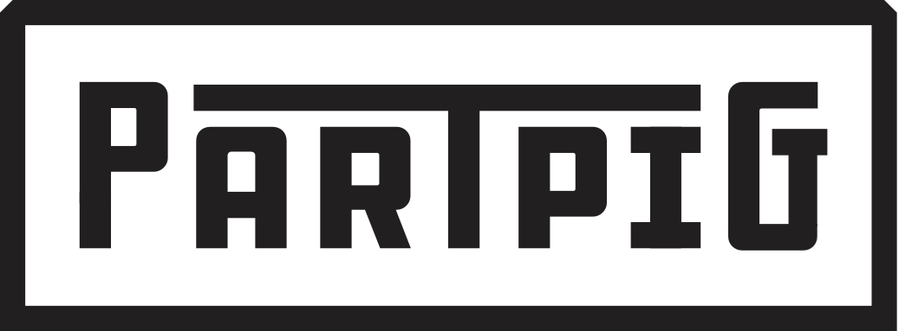

## PartPig
PartPig is an ecommerce platform for selling used car parts.

## Motivation
PartPig exists to fill the gap in connecting the buyer and the seller in a way that is user friendly and convenient

## Usage
PartPig is still in beta. Because of that we focused most of the parts for sale under 
- make: Subaru
- model: Impreza WRX STI
- year: 2007

To see most of the used parts we currently have listed please search that category.

### Project
view this project [live](https://partpig.briantmorris.com)

## Features

- [x] Image upload and hosting with AWS
- [x] Email integration with SendGrid
- [x] Seamlessly list a part!
- [x] User Dashboard with editable listings.

## Technologies used
- [React](https://reactjs.org/)
- [PHP](http://www.php.net/)
- [AWS](https://aws.amazon.com/)
- [MySQL](https://www.mysql.com/)
- [Confluence/Jira](https://www.atlassian.com/software)